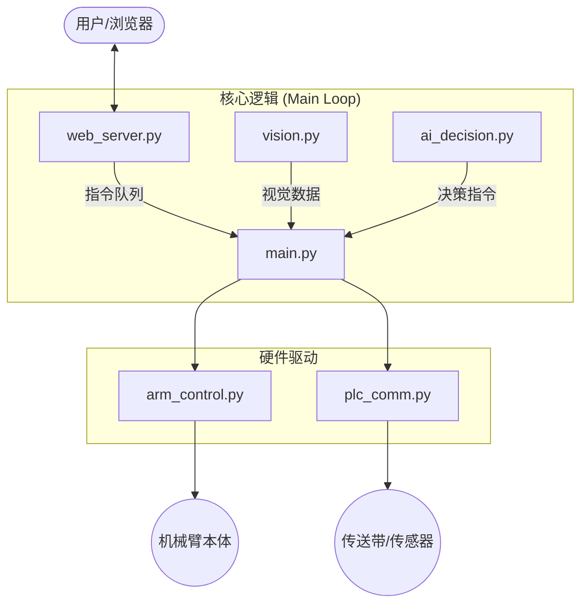

## 📂 模块文件说明

### 1. `web_server.py` (Web 服务端)
**职责**：系统的用户交互层（Frontend-Backend Bridge）。
* **核心功能**：
    * 启动 Flask 服务器，托管 Web 界面。
    * 提供视频流接口 (`/video_feed`)，将处理后的 OpenCV 图像实时推送到浏览器。
    * 处理 API 请求：包括 `/chat` (AI 对话)、`/command` (按钮指令)、`/status` (系统状态同步)。
    * **流式响应**：支持 Server-Sent Events (SSE) 或流式文本传输，实现 AI 回复的“打字机”效果。

### 2. `ai_decision.py` (AI 决策大脑)
**职责**：系统的智能决策层（LLM Interface）。
* **核心功能**：
    * 封装各大模型接口（DeepSeek, OpenAI, Gemini 等）。
    * **Prompt 工程**：管理 System Prompt，注入实时库存状态 (`inventory`)，防止 AI 做出非法决策。
    * **指令解析**：从 AI 的自然语言回复中提取 JSON 控制指令（如 `{"type": "sort", ...}`）。
    * 支持流式输出 (`stream=True`)，提升用户交互体验。

### 3. `arm_control.py` (机械臂驱动)
**职责**：系统的执行层（Hardware Driver）。
* **核心功能**：
    * 封装 `pymycobot` 库，提供更高级的控制接口。
    * **安全机制**：包含强制上电 (`power_on`)、异常捕获和动作复位逻辑。
    * **运动规划**：实现了 `pick` (抓取)、`place` (放置)、`go_observe` (归位) 等原子动作序列。
    * 坐标转换：将逻辑坐标转换为机械臂关节角度。

### 4. `vision.py` (视觉感知)
**职责**：系统的感知层（Computer Vision）。
* **核心功能**：
    * 调用 OpenCV 读取摄像头数据。
    * **图像处理**：执行颜色阈值分割、轮廓查找、噪声过滤。
    * **坐标变换**：将图像像素坐标 $(u, v)$ 转换为机械臂空间坐标 $(x, y, z)$。
    * 实时标注：在视频流上绘制识别框和置信度，供 Web 端展示。

### 5. `plc_comm.py` (PLC 通信)
**职责**：外部自动化扩展（Automation Interface）。
* **核心功能**：
    * 负责与工业 PLC 或外部控制器通信（通常通过 Modbus 或 IO 信号）。
    * 控制传送带启停、读取光电传感器状态等（视具体硬件接入情况而定）。

### 6. `mock_hardware.py` (硬件模拟)
**职责**：开发与测试（Simulation）。
* **核心功能**：
    * 在没有连接真实机械臂或摄像头时，提供虚拟的摄像头画面和机械臂响应。
    * 允许开发者在纯软件环境下调试 Web 界面和 AI 逻辑。

---

## 🔄 模块交互流程图

---

## ⚠️ 开发注意事项

1. **依赖关系**：`main.py` 是系统的总入口，它负责实例化上述所有类并协调工作。请勿直接运行模块文件（除了单元测试）。
2. **配置读取**：大部分模块都会读取 `config/` 目录下的配置文件（如 `ai_config.json`, `settings.py`），修改代码时请确保配置键值对应。
3. **线程安全**：`web_server.py` 在独立线程中运行，访问共享变量（如 `system_state`）时需注意数据同步。